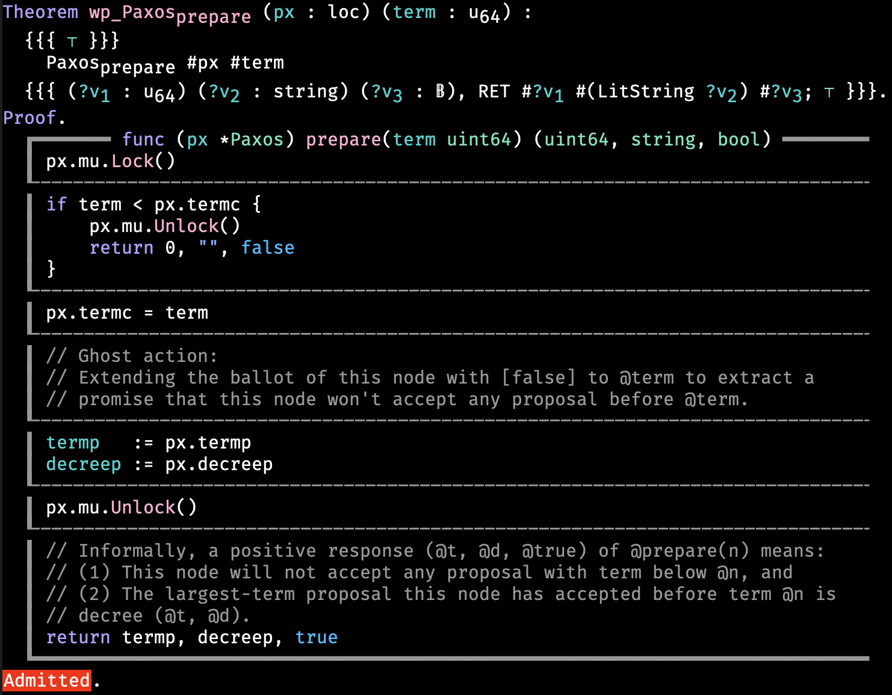

# Mixcode: mixing code in your proof

Features:

* prettifying commented blocks of code
* generating commented blocks of code for functions and structs
* generating an initial WP thoerem statement for functions

Support for code in [Go](https://go.dev/), proof in [Perennial](https://github.com/mit-pdos/perennial) + [Iris](https://iris-project.org/) + [Coq](https://coq.inria.fr/).

Below is an example automatically generated with mixcode:



## Setup

Download `mixcode.el`.

To enable it manually, run the following commands in Emacs (using <kbd>M-x</kbd>):
```elisp
(load /path/to/mixcode.el)
(mixcode-mode)
```

To enable it automatically in Coq mode, add the following to your `.emacs`:
```elisp
(add-hook 'coq-mode-hook
          (lambda ()
            (load-file "/path/to/mixcode.el")
            (mixcode-mode)))
```

## Usage

### Loading source file

`M-x mixcode-load-file RET file-path`

### Generating commented block of code for a function/struct

`M-x mixcode-insert-code RET func/struct`

### Generating WP theorem statement (incl. commented block of code)

`M-x mixcode-insert-wp RET func`

Remember to use `TAB` to see what's loaded and to auto-complete!

### Generating representation predicate for a struct

`M-x mixcode-insert-rp RET struct`

### Generating commented block of code for line numbers

`M-x mixcode-insert-code-with-numbers RET line-numbers`

### Generating a separate line

`M-x mixcode-insert-sep RET`

## Known issues

* WP generation fails for higher-order function
* Function signature parsing won't work for multiple lines
* RP generation misses parentheses for multiple return values
* Inline code doesn't seem to work with some map type

## Features wanted

* Generating representation predicates based on struct definition
* Including comments for function and struct
* Diffing (comparing commented code with some Go source)
* Backward syncing (updating commented code and reflecting changes in real code)
